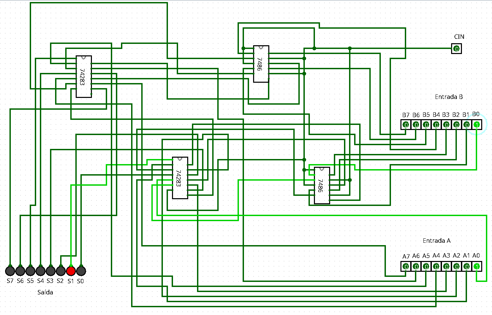

# Somador / Subtrator de 8 bits

Tabalho 2 de Sistemas Digitais onde deve projetar usando logism e prototipar circuito digital somador/subtrator de 8 bits. A entrada Cin deve selecionar (0=soma; 1=subtração) a operação que será realizada entre as entradas A e B.  As entradas
serão fornecidas usando o switch buttons e as saídas serão visualizadas usando os LEDs.

## Como usar

Ao abrir no logism o trabalho_2.circ você verá duas entradas de 8 bits A e B, além de uma entrada CIN de 1 bit, com funcionamento se baseando quando o CIN for 0, será mostrado nos 8 leds de saída A + B. Quando Cin for 1, será mostrado nos 8 leds de saída A - B.

### Imagem do circuito funcionando
